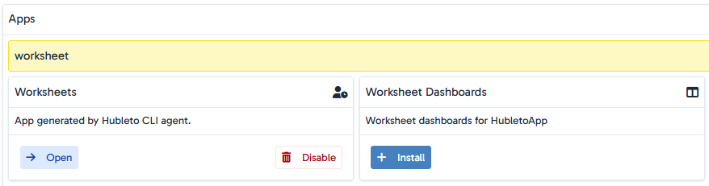
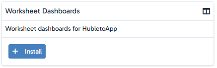
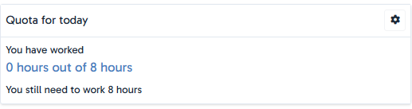
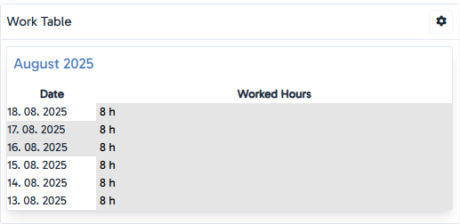
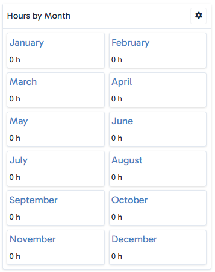
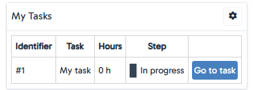

# Worksheet dashboards for Hubleto

Worksheet dashboards is an addon for the management apps in Hubleto.
It adds multiple new panels to the Dashboard app to choose from.

- [Worksheet dashboards for Hubleto](#worksheet-dashboards-for-hubleto)
  - [Required apps](#required-apps)
  - [Installation](#installation)
  - [Available panels](#available-panels)
    - [Quota for today](#quota-for-today)
      - [Configuration](#configuration)
    - [Work Table](#work-table)
      - [Configuration](#configuration-1)
    - [Hours by Month](#hours-by-month)
      - [Configuration](#configuration-2)
    - [My Tasks](#my-tasks)
      - [Configuration](#configuration-3)

## Required apps

These apps are required for the panels to work.

| App                             |
| ------------------------------- |
| HubletoApp\Community\Worksheets |
| HubletoApp\Community\Pipeline   |
| HubletoApp\Community\Tasks      |

## Installation

1. In your project write this command in your terminal:

   `composer require rindo789/hubleto-worksheet-boards`

2. In Hubleto Maintenance > Settings > Manage apps search for "Worksheet".
   
3. Click "Install" in the "Worksheet Dashboards" app.
   
4. Installation done! Now you can add the new panels in your dashboard.

## Available panels

Configuration of tables is done trough the form of the panel. By Hubleto standards, the configuration is done in a JSON format.

### Quota for today

Shows many hours you have worked today and shows how many hours you still need to work to hit your quota

#### Configuration

| Name  | Description               | Default value |
| ----- | ------------------------- | ------------- |
| quota | Your daily quota in hours | 8             |

### Work Table

Shows a table summary of how many hours you have worked each day in a given range of days and if you have hit your quota in those days

#### Configuration

| Name  | Description                                                 | Default value |
| ----- | ----------------------------------------------------------- | ------------- |
| quota | Your daily quota in hours                                   | 8             |
| range | Number of days from today that should be shown in the table | 30            |

### Hours by Month

Shows have many hours you have worked in each month in the current year

#### Configuration

This panel does not have any configurations.

### My Tasks

Shows tasks that are assigned to you with a brief summary and a link to the task

#### Configuration

This panel does not have any configurations.
