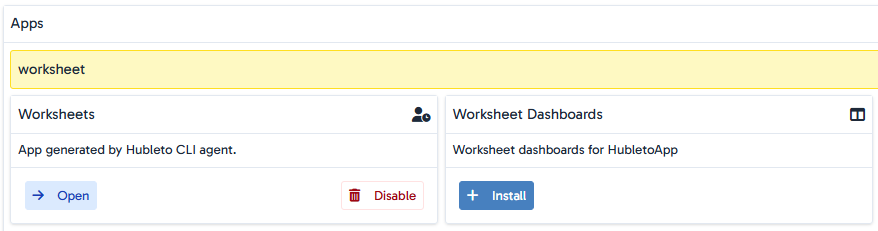
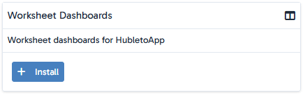
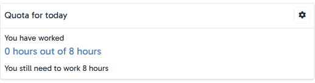
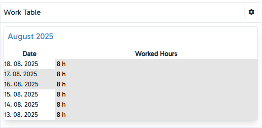
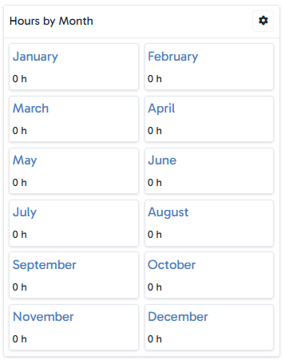
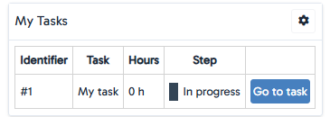
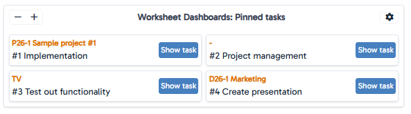
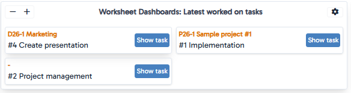

# Worksheet dashboards for Hubleto

Worksheet dashboards is an addon for the management apps in Hubleto.
It adds multiple new panels to the Dashboard app to choose from.

- [Worksheet dashboards for Hubleto](#worksheet-dashboards-for-hubleto)
  - [Required apps](#required-apps)
  - [Installation](#installation)
  - [Available panels](#available-panels)
    - [Quota for today](#quota-for-today)
      - [Configuration](#configuration)
      - [Example configuration](#example-configuration)
    - [Work Table](#work-table)
      - [Configuration](#configuration-1)
      - [Example configuration](#example-configuration-1)
    - [Hours by Month](#hours-by-month)
      - [Configuration](#configuration-2)
      - [Example configuration](#example-configuration-2)
    - [My Tasks](#my-tasks)
      - [Configuration](#configuration-3)
      - [Example configuration](#example-configuration-3)
    - [Pinned Tasks](#pinned-tasks)
      - [Configuration](#configuration-4)
      - [Example configuration](#example-configuration-4)
    - [Latest worked on tasks](#latest-worked-on-tasks)
      - [Configuration](#configuration-5)
      - [Example configuration](#example-configuration-5)

## Required apps

These apps are required to be installed for the panels to work.

| App                              |
| -------------------------------- |
| Hubleto\App\Settings\Auth       |
| Hubleto\App\Community\Leads |
| Hubleto\App\Community\Deals   |
| Hubleto\App\Community\Projects      |
| Hubleto\App\Community\Tasks      |
| Hubleto\App\Community\Workflow      |
| Hubleto\App\Community\Worksheets   |

## Installation

1. In your project write this command in your terminal:

   `composer require rindo789/hubleto-worksheet-boards`

2. In Hubleto Maintenance > Settings > Manage apps search for "Worksheet".


   

3. Click "Install" in the "Worksheet Dashboards" app.


   

4. Installation done! Now you can add the new panels in your dashboard.

## Available panels

Configuration of tables is done through the form of the panel. By Hubleto standards, the configuration is done in a JSON format.

### Quota for today

Shows how many hours you have worked today and shows how many hours you still need to work to hit your quota



#### Configuration

| Name          | Description                                                                                                                                                   | Default value |
| ------------- | ------------------------------------------------------------------------------------------------------------------------------------------------------------- | ------------- |
| quota         | Your daily quota in hours                                                                                                                                     | 8             |
| employeeEmail | By imputing an email of an employee, changes the panel to show information of another employee. Works only for administrator, manager and chief officer users | null          |

#### Example configuration

```json
{
  "quota": 8,
  "employeeEmail": "dev@hubleto.com"
}
```

### Work Table

Shows a table summary of how many hours you have worked each day in a given range of days and if you have hit your quota in those days



#### Configuration

| Name          | Description                                                                                                                                                   | Default value |
| ------------- | ------------------------------------------------------------------------------------------------------------------------------------------------------------- | ------------- |
| quota         | Your daily quota in hours                                                                                                                                     | 8             |
| range         | Number of days from today that should be shown in the table                                                                                                   | 30            |
| employeeEmail | By imputing an email of an employee, changes the panel to show information of another employee. Works only for administrator, manager and chief officer users | null          |

#### Example configuration

```json
{
  "quota": 8,
  "range": 60,
  "employeeEmail": "dev@hubleto.com"
}
```

### Hours by Month

Shows have many hours you have worked in each month in the current year



#### Configuration

| Name          | Description                                                                                                                                                   | Default value |
| ------------- | ------------------------------------------------------------------------------------------------------------------------------------------------------------- | ------------- |
| year          | Shows worked hours from the specified year                                                                                                                    | Current year  |
| employeeEmail | By imputing an email of an employee, changes the panel to show information of another employee. Works only for administrator, manager and chief officer users | null          |

#### Example configuration

```json
{
  "year": 2025,
  "employeeEmail": "dev@hubleto.com"
}
```

### My Tasks

Shows tasks that are assigned to you with a brief summary and a link to the task



#### Configuration

| Name          | Description                                                                                                                                                   | Default value |
| ------------- | ------------------------------------------------------------------------------------------------------------------------------------------------------------- | ------------- |
| employeeEmail | By imputing an email of an employee, changes the panel to show information of another employee. Works only for administrator, manager and chief officer users | null          |

#### Example configuration

```json
{
  "employeeEmail": "dev@hubleto.com"
}
```

### Pinned Tasks

Allows you to pin specified tasks to be shown on the dashboard



#### Configuration

| Name          | Description                                                                                                                                                   | Default value |
| ------------- | ------------------------------------------------------------------------------------------------------------------------------------------------------------- | ------------- |
| pinnedTasks | An array of task IDs | null          |

#### Example configuration

```json
{
  "pinnedTasks": [1,2,3]
}
```
### Latest worked on tasks

Shows you tasks that you worked on recently




#### Configuration

| Name          | Description                                                                                                                                                   | Default value |
| ------------- | ------------------------------------------------------------------------------------------------------------------------------------------------------------- | ------------- |
| numberOfTasks | The number of latest tasks | 10          |

#### Example configuration

```json
{
  "numberOfTasks": 5
}
```
